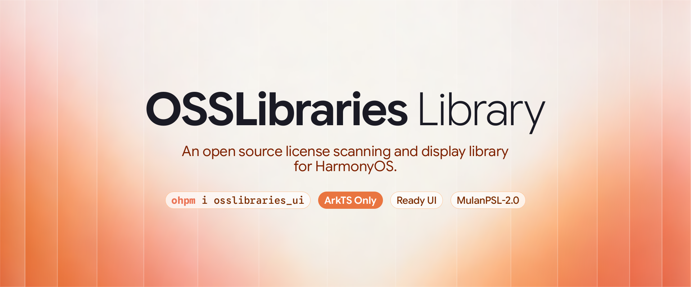
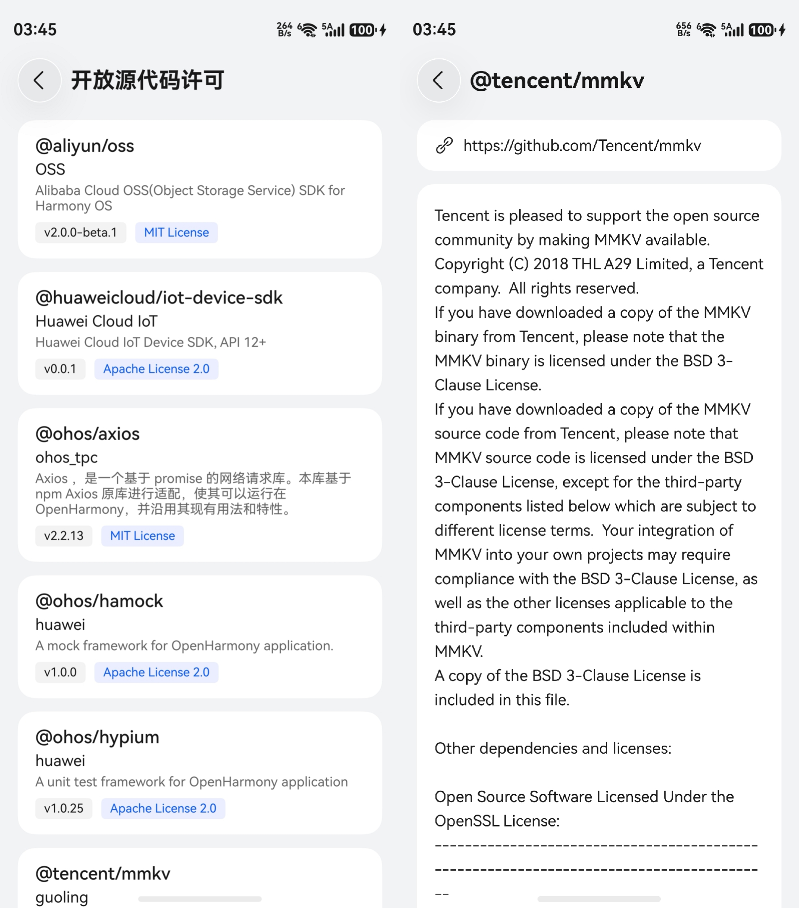

# OSSLibraries

一个适用于 HarmonyOS 的开放源代码许可扫描与展示库。



[English](README.md)

> [!NOTE]
> 本库不支持仓颉（Cangjie）鸿蒙应用。根据华为文档，仓颉鸿蒙应用不支持增加 ArkTS 页面，也不支持调用三方 ArkTS 库；而本库基于 ArkTS 页面与组件实现。

## 演示截图



## 快速接入（带预定义 UI）

> [!TIP]
> 可以安装该库提供的 Agent Skills，让 AI Agent 帮助快速在 HarmonyOS 项目中集成该库：
> 
> ```zsh
> npx skills add composable-tu/osslibraries
> ```

### 添加 OHPM 模块依赖

```zsh
ohpm install osslibraries_ui
```

### 注册 Hvigor 插件

依赖库许可信息扫描器是一个独立的 Hvigor 插件 `osslibraries-hvigor-plugin`，需要在编译 ArkTS 前运行，它会将 `osslibraries.json` 写入 `entry` 模块（也可以自定义载入哪个模块，这里仅以 `entry` 举例）的 `rawfile` 目录。

使用 npm 安装：

```zsh
npm install osslibraries-hvigor-plugin --save-dev
```

也可以使用 Yarn、pnpm、Vite+、vlt、Bun 等包管理器/构建工具安装：

```zsh
yarn add osslibraries-hvigor-plugin --dev
pnpm add osslibraries-hvigor-plugin -D
vp add osslibraries-hvigor-plugin -D
vlt install osslibraries-hvigor-plugin -D
bun add osslibraries-hvigor-plugin -D
```

然后编辑 `entry/hvigorfile.ts` 以注册插件:

```TS
import { hapTasks } from '@ohos/hvigor-ohos-plugin';
import { ossScanPlugin } from 'osslibraries-hvigor-plugin';

export default {
  system: hapTasks,
  plugins: [ossScanPlugin()]
}
```

> [!TIP]
> 如果你的项目有不想出现在 License 列表中的模块，可以将依赖名传入 `selfModules`:
>
> ```ts
> plugins: [ossScanPlugin({ selfModules: ['mylibrary', '3rdlibrary'] })]
> ```

每次构建时，插件会扫描 `oh_modules/` 并生成 `entry/src/main/resources/rawfile/osslibraries.json`。

### 导入 HAR 页面（注册命名路由）

在 `entry` 模块的页面文件顶部（如 `Index.ets`）添加:

```ets
import 'osslibraries_ui/src/main/ets/pages/OSSLibrariesLicenseListPage';
import 'osslibraries_ui/src/main/ets/pages/OSSLibrariesLicenseDetailPage';
```

`entry` 模块的 `main_pages.json` 无需改动，只需保留自身页面即可。

### 跳转到许可列表页

在应用的任意页面中，通过 `pushNamedRoute` 跳转到列表页:

```ets
this.getUIContext().getRouter().pushNamedRoute({
  name: 'OSSLibrariesLicenseListPage'
});
```

## 自定义 UI

可以不使用预定义的 OSSLibraries UI 页面，直接使用 `core` 模块:

```zsh
ohpm install osslibraries
```

然后，在自定义页面中按以下方法读取 `osslibraries.json`：

```ets
import { util } from '@kit.ArkTS';
import { common } from '@kit.AbilityKit';
import { Libs, LibsHolder } from 'osslibraries';

// 读 osslibraries.json
const context: common.Context = this.getUIContext().getHostContext() as common.Context;
const content: Uint8Array = await context.resourceManager.getRawFileContent('osslibraries.json');
const json: string = util.TextDecoder.create('utf-8').decode(content);

// 解析 JSON
const libs: Libs = Libs.fromJson(json);

// 查找某个库
const lib = libs.findLibrary('@ohos/hypium');

// 跨页面共享数据
LibsHolder.set(libs);
```

## 许可证

Mulan PSL v2

## 致谢

本项目在一定程度上参考了 [mikepenz/AboutLibraries](https://github.com/mikepenz/AboutLibraries) 的代码实现，在此表示感谢。
